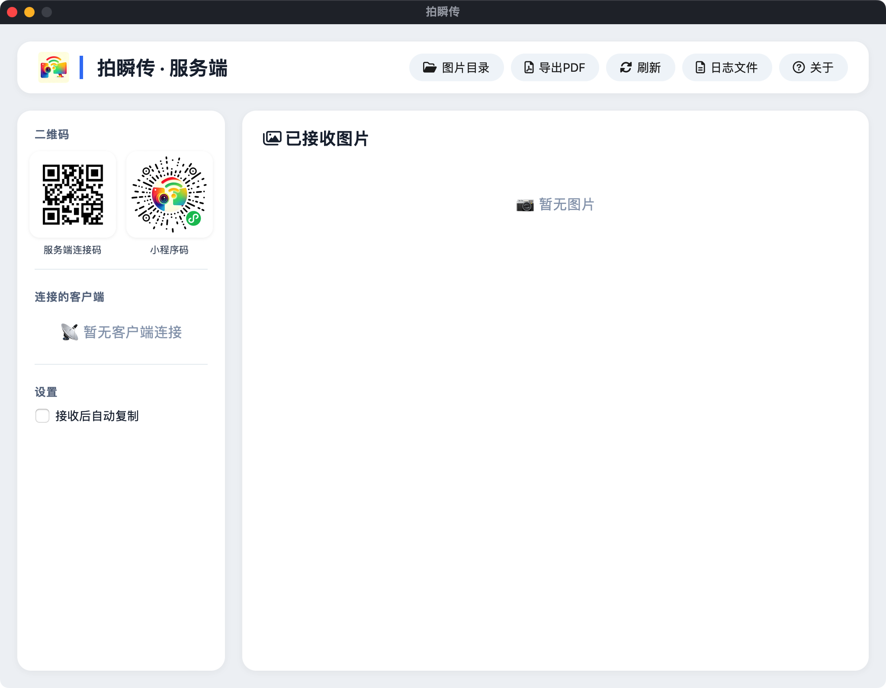

# 📸 拍瞬传 (PaiSnap)

> 局域网内手机拍照，一键传电脑 —— 模拟扫描仪、快速收集照片的最佳工具。

[](https://go.dev/)
[](https://wails.io/)
[](https://developers.weixin.qq.com/miniprogram/dev/framework/)

---

## 📖 项目简介

**拍瞬传** 是一款纯局域网工具，包含 **微信小程序端** 和 **Wails 桌面应用端**。  
用户可在小程序中调用手机摄像头拍照，照片通过 HTTP 协议上传至同一 WiFi 下的电脑，电脑端自动按标签分类保存，并提供 Web 状态页进行管理和预览。

### 🎯 适用场景

- 📄 家庭、办公室、教育机构内快速将纸质文件扫描成电子档（模拟扫描仪）
- 📸 活动、会议中收集现场照片
- 🛠️ 个人开发者调试图片上传功能
- 🚀 任何需要手机 → 电脑快速传图的场景

---

## ✨ 功能特性

### 🖥️ 桌面端服务 (Wails)

- ✅ 接收图片上传，支持 **标签分组**（自动创建子目录）
- ✅ 实时显示 **已连接的客户端** IP 及活跃时间
- ✅ **二维码** 展示服务地址，手机扫码自动连接
- ✅ 图片管理：**复制图片到剪贴板**、**删除图片**（同时删除磁盘文件）
- ✅ **一键打开** 图片保存目录
- ✅ Web 状态页，支持手动刷新、自动刷新（收到上传事件后）
- ✅ 保留最近 **50 张** 图片，按标签分组展示，可折叠/展开
- ✅ 跨平台支持：Windows / macOS / Linux
- ✅ 端口自动递增（5000 被占用时自动切换）

### 📱 小程序端

- ✅ **全屏相机界面**，类似原生相机体验
- ✅ **悬浮拍照按钮**，点击拍照并上传
- ✅ **WiFi 检测**：未连接 WiFi 时无法进入拍照页
- ✅ **扫码连接**：扫描服务端二维码，自动配置地址
- ✅ **手动配置**：支持手动输入服务端 IP + 端口
- ✅ **健康检查**：持续检测服务端状态，断线自动提醒重连
- ✅ **标签管理**：支持设置标签，拍照时自动上传至对应分组
- ✅ **摄像头控制**：翻转摄像头、闪光灯、分辨率（低/中/高）
- ✅ **设置面板**：半透明悬浮，可调节各项参数
- ✅ **帮助页面**：内置使用说明和桌面端下载指引

---

## 🖼️ 项目截图（需要准备）

> 
> 

---

## 🛠️ 技术栈

| 组件       | 技术                                      |
|-----------|-------------------------------------------|
| 桌面端     | Go 1.21+、Wails 2.7.1、HTML/CSS/JS、WebSocket |
| 小程序端   | 微信小程序原生框架、Camera API、wx.uploadFile |
| 状态页     | HTML5、CSS3、JavaScript、QRCode.js       |
| 打包方式   | Wails 编译为单可执行文件，小程序发布至微信后台 |

---


## 🚀 快速开始

### 1. 启动桌面端应用

#### 方法一：直接运行可执行文件（推荐）
- 从 [Releases](https://github.com/你的仓库/拍瞬传/releases) 下载对应系统的二进制文件
- 双击运行（Windows）或 `./拍瞬传`（macOS/Linux）
- 桌面应用将自动打开状态页窗口，并显示服务端二维码

#### 方法二：从源码构建
```bash
# 安装 Wails
go install github.com/wailsapp/wails/v2/cmd/wails@latest

# 克隆项目
git clone https://github.com/shixw/paishunchuan.git
cd paishunchuan/desktop

# 运行开发模式
wails dev

# 打包为可执行文件
wails build
```

### 2. 使用流程

1. 电脑端：确保桌面端服务已运行，防火墙允许当前使用的 HTTP 端口（默认 5000，若被占用会自动递增）

2. 手机端：连接同一 WiFi → 打开小程序 → 点击“扫码连接”扫描电脑状态页二维码 → 连接成功

3. 拍照：点击悬浮按钮拍照，照片自动上传并按当前标签分组保存

4. 管理：电脑状态页可查看、复制、删除图片，支持分组折叠

--- 

## 👤 作者
[shixw] - [shixw_usr@126.com]

--- 

## 🙏 致谢

- Wails - 构建桌面应用
- QRCode.js - 二维码生成
- 微信小程序官方文档
- Go 语言社区

--- 

**拍瞬传 —— 让手机拍照，瞬间抵达电脑。**
